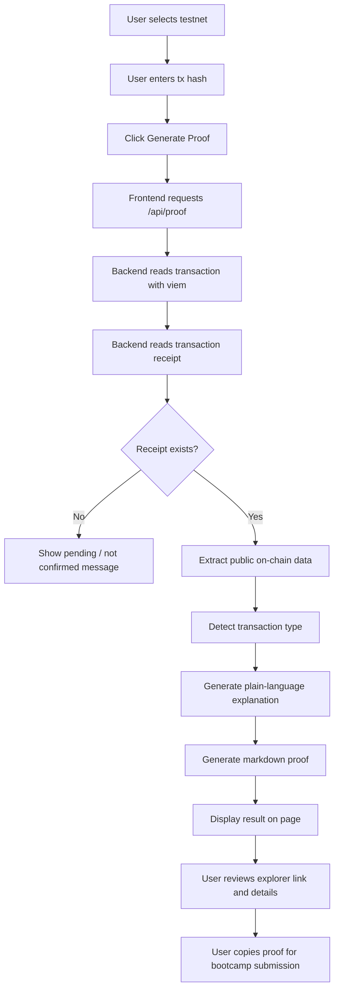

# Week 1｜AI × Web3 Minimal Flow: Bootcamp Proof Generator

Status: done

## 项目想法

**Bootcamp Proof Generator** 是一个最小全栈项目设想。

它的目标很简单：用户输入一笔测试网交易哈希 `tx hash`，再选择网络。系统读取这笔链上交易和交易 receipt，然后用大白话解释这笔交易做了什么，并生成一段可以复制提交到 bootcamp 作业里的证明文本。

这个项目不需要连接钱包，不需要私钥，也不发送交易。它只读取公开链上数据，所以更适合作为 Week 1 的 AI × Web3 最小交叉实验。

## 为什么它符合 AI × Web3 最小交叉流程

它把 Week 1 学到的几件事串在一起：

- Web3 部分：交易哈希、区块浏览器、receipt、gas、from / to、合约地址、交易状态。
- AI 部分：把链上数据解释成大白话，并生成可提交的 proof 文本。
- 安全部分：只读公开数据，不碰私钥，不签名，不发交易。
- 人工确认部分：用户复制 proof 前，需要自己检查链上数据和解释是否正确。

## 技术栈设想

- Next.js App Router
- TypeScript
- Tailwind CSS
- viem
- API route: `/api/proof`
- 不连接钱包
- 不读取私钥
- 不发送交易

## MVP 支持网络

- Ethereum Sepolia
- Base Sepolia
- Arbitrum Sepolia
- Optimism Sepolia

## 核心流程图



## 页面展示内容

用户输入 tx hash 后，页面展示：

- 网络
- tx hash
- 区块浏览器链接
- 状态：`success` / `failed` / `pending`
- `from` 地址
- `to` 地址，或新部署合约地址
- 区块高度
- gas used
- 预估 gas fee
- 检测到的交易类型
- 大白话解释
- 可复制的 markdown proof

## 交易类型检测思路

MVP 不需要做到很复杂，只做基础判断：

- 如果 receipt 不存在：可能还没确认。
- 如果 transaction `to` 为空，并且 receipt 有 `contractAddress`：可能是合约部署。
- 如果 transaction `to` 存在，且 input data 不为空：可能是合约调用。
- 如果 transaction `to` 存在，且 input data 很短或为空：可能是普通转账。
- 如果 receipt status 是 failed：说明交易执行失败，但仍可能消耗 gas。

这些判断都只能基于已有链上数据，不能编造。

## 生成的 Proof 示例

```md
## Bootcamp Transaction Proof

- Network: Ethereum Sepolia
- Transaction Hash: 0x...
- Explorer: https://sepolia.etherscan.io/tx/0x...
- Status: success
- From: 0x...
- To / Contract: 0x...
- Block Number: 10884124
- Gas Used: 37075

Plain-language explanation:

This transaction called a smart contract on Sepolia. It changed on-chain state, so it required wallet confirmation and gas. The transaction succeeded and can be verified on the block explorer.

Safety note:

This proof was generated from public on-chain data only. No private key, mnemonic, API key, or wallet signature was used.
```

## 失败处理

系统必须清楚显示错误，不能假装成功：

- 如果 tx hash 格式不对：提示用户检查输入。
- 如果 RPC 读取失败：显示网络或 RPC 错误。
- 如果 receipt 不存在：说明交易可能 pending 或还没被确认。
- 如果网络和 tx hash 不匹配：提示用户换网络查询。
- 如果交易失败：展示 failed，并解释失败交易也可能消耗 gas。

## AI 参与边界

AI 可以做：

- 把 transaction 和 receipt 解释成大白话。
- 生成 bootcamp proof 的 markdown 草稿。
- 提醒用户检查区块浏览器链接、网络和交易状态。

AI 不可以做：

- 编造 tx hash。
- 编造区块浏览器链接。
- 编造链上数据。
- 推断链上数据里没有的信息。
- 请求或保存私钥、助记词、API Key。
- 发送交易、签名或授权。

## 人工确认节点

虽然这个工具不发交易，但仍然需要人工确认：

- 用户提交 tx hash 前，要确认网络选对。
- 用户复制 proof 前，要检查 explorer 链接能打开。
- 用户提交 bootcamp 前，要确认状态、地址、gas 和解释没有明显错误。
- 如果 AI 总结和链上数据不一致，以链上数据和区块浏览器为准。

## 我的理解

这个项目的重点不是做一个复杂产品，而是把 AI 和 Web3 放进同一条安全流程里：Web3 提供可验证的公开数据，AI 负责解释和整理，人负责最后确认。

我觉得这比“让 AI 自动操作钱包”更适合 Week 1。因为它不碰私钥、不签名、不发交易，只围绕公开链上数据生成学习证明。这样既能体现 AI × Web3 的结合，也能保留清楚的安全边界。

## 可提交证明

这份项目设想满足任务要求：

- [x] 画出了 AI × Web3 最小交叉流程。
- [x] 包含用户输入、链上读取、AI 解释、人工复核和 proof 输出。
- [x] 标出了失败点和错误处理。
- [x] 标出了 AI 不能做的事情。
- [x] 不包含私钥、助记词、API Key 或真实资产敏感信息。
