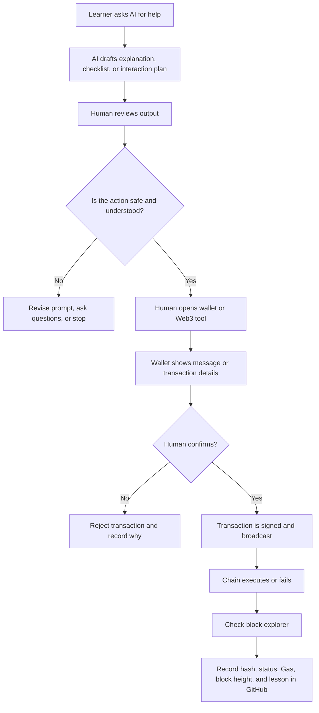

# Week 1 AI x Web3 Minimal Flow

Status: draft

## Human Confirmation Points

- Before using any wallet.
- Before signing any message.
- Before sending any transaction.
- Before approving token permissions.
- Before publishing public proof.

## Failure Points

- AI gives incorrect explanation.
- Wallet is on the wrong network.
- Faucet fails.
- Transaction fails or runs out of Gas.
- Contract address is wrong.
- Explorer link points to the wrong chain.

## Recovery Actions

- Stop and inspect the exact error.
- Check network and address.
- Use block explorer to verify status.
- Ask AI to explain the error, but verify with docs or actual output.
- Record the failure as learning proof.

## Things The Agent Must Not Do

- Store private keys or mnemonics.
- Auto-sign wallet messages.
- Auto-send transactions.
- Auto-approve token allowances.
- Hide transaction details from the human.

