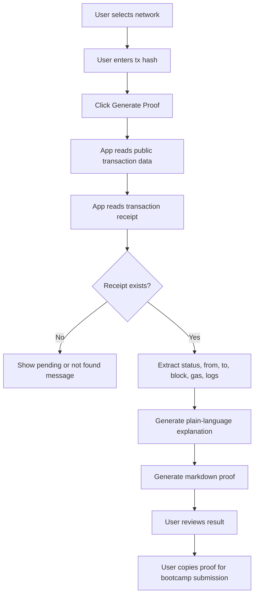

# Week 1｜综合进阶：Bootcamp Proof Generator

Status: done

## 项目链接

- Live demo: https://bootcamp-proof-generator-dz.vercel.app
- GitHub repo: https://github.com/dylan070620/bootcamp-proof-generator_dz

## 项目简介

**Bootcamp Proof Generator** 是我做的一个受限 Web3 助手原型。

它解决的问题很具体：bootcamp 学员经常需要提交测试网交易证明，但交易哈希、区块浏览器、gas、receipt、from / to 地址这些信息对新手来说比较分散。这个工具让用户输入一个测试网交易哈希，并选择网络，然后系统读取公开链上数据，生成一段更容易理解、可以复制提交的 proof markdown。

它不是一个自动交易机器人，也不是钱包工具。它只做一件事：**读取公开链上数据，并帮助用户整理学习证明。**

## 输入和输出

用户输入：

- 测试网网络
- 交易哈希 `tx hash`

工具输出：

- 网络
- tx hash
- 区块浏览器链接
- 交易状态
- from 地址
- to 地址或合约地址
- 区块高度
- gas used
- 交易类型判断
- 大白话解释
- 可复制的 markdown proof

## 支持的网络

MVP 支持多个测试网方向：

- Ethereum Sepolia
- Base Sepolia
- Arbitrum Sepolia
- Optimism Sepolia

## Workflow

## AI / Agent 可以辅助什么

这个工具代表一种比较安全的 AI × Web3 工作方式：

- AI 可以帮用户解释交易做了什么。
- AI 可以把链上数据整理成作业 proof。
- AI 可以提醒用户检查网络、状态、gas 和 explorer 链接。
- AI 可以帮助新手理解 read / write、合约调用、合约部署、交易失败等概念。

## 它不能做什么

这个项目刻意限制了执行权限：

- 不连接钱包。
- 不读取私钥。
- 不读取助记词。
- 不请求 API Key。
- 不发送交易。
- 不自动签名。
- 不自动授权 token。
- 不自动调用合约写入函数。
- 不编造 tx hash、explorer 链接或链上数据。

## 人工确认点

虽然这个工具只读链上数据，但仍然需要用户自己确认：

- 输入 tx hash 前，确认网络选对。
- 复制 proof 前，检查区块浏览器链接是否能打开。
- 提交作业前，确认交易状态、地址、gas 和解释没有明显错误。
- 如果工具解释和区块浏览器数据冲突，以区块浏览器和链上数据为准。

## 风险和限制

- RPC 或 explorer 服务可能失败，读取不到数据。
- 用户可能选错网络，导致查不到交易。
- 交易 receipt 不存在时，交易可能还没确认，也可能 hash 输错。
- 交易类型判断只能基于公开字段做基础判断，不能保证理解所有复杂合约逻辑。
- AI 或自动解释只能总结已有数据，不能凭空推断交易意图。

## 如何验证结果

我验证这个项目的方式：

1. 打开 live demo。
2. 选择测试网。
3. 输入真实测试网交易哈希。
4. 检查页面返回的状态、from / to、区块高度和 gas。
5. 打开区块浏览器链接，对照交易详情。
6. 复制生成的 markdown proof，确认没有私钥、助记词、API Key 或敏感信息。

## 我的理解

这个项目让我更清楚地理解了“受限 Web3 助手”的边界。

我不应该一上来就做一个能替用户签名、转账、调用合约的 agent。更合理的第一步，是做一个只读型助手：它帮助用户理解链上数据、整理 proof、减少手动复制错误，但不直接接触钱包权限。

这类工具虽然功能小，但安全边界清楚，很适合 bootcamp 早期学习和任务提交场景。

## 可提交证明

- [x] 有 live demo。
- [x] 有 GitHub repo。
- [x] 说明了解决什么问题。
- [x] 给出了输入和输出。
- [x] 标出了人工确认点。
- [x] 列出了至少 3 个风险或限制。
- [x] 说明了如何验证结果。
- [x] 不包含私钥、助记词、API Key、token 或 `.env` 文件。
