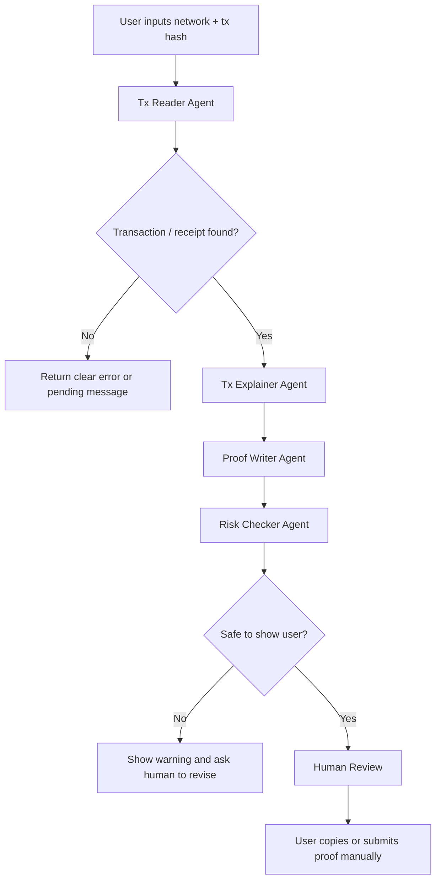

# Week 2｜Multi-Agent Handoff 设计记录

Status: draft

## 背景

我打算后面把 **Bootcamp Proof Generator** 从单一工具，逐步扩展成一个多 agent workflow。

当前版本只是一个只读型 Web3 助手：用户输入网络和 tx hash，系统读取公开链上数据，然后生成解释和 proof。这个版本安全边界很清楚，因为它不连接钱包、不签名、不发交易。

但如果后面功能变多，一个 agent 什么都做会很乱，也很难控制风险。所以我想把任务拆成多个更小的 agent，并设计清楚 handoff，也就是“什么时候把任务交给下一个 agent，以及交接时带哪些信息”。

## 为什么需要 Handoff

多 agent 的重点不是“agent 越多越高级”，而是让每个 agent 只负责一类清楚的任务。

我想要的效果：

- 读取链上数据的 agent 不负责写总结。
- 写总结的 agent 不负责判断权限。
- 判断权限的 agent 不负责提交任务。
- 任何涉及钱包、签名、授权、转账、合约写入的动作，都不能自动 handoff 到执行。

这样可以降低混乱和越权风险。

## 初步 Agent 分工

| Agent | 负责什么 | 不能做什么 |
| --- | --- | --- |
| Tx Reader Agent | 根据网络和 tx hash 读取 transaction / receipt / logs | 不能解释超出链上数据的意图，不能发交易 |
| Tx Explainer Agent | 把链上字段翻译成大白话 | 不能编造数据，不能覆盖原始链上结果 |
| Proof Writer Agent | 生成 bootcamp / README / WCB 可提交的 markdown proof | 不能提交 WCB，不能隐藏风险 |
| Risk Checker Agent | 检查 proof 是否包含敏感信息，检查解释是否越界 | 不能自动修改链上权限 |
| Human Review | 最终确认 proof、提交 WCB、决定是否执行任何高风险动作 | 人必须看到关键数据和风险提示 |

## Handoff 流程



## Handoff 时要传递的状态

每次 agent 交接时，不能只传一段自然语言总结，还要传结构化状态。

建议 handoff payload：

```json
{
  "network": "Ethereum Sepolia",
  "txHash": "0x...",
  "explorerUrl": "https://...",
  "transaction": {
    "from": "0x...",
    "to": "0x...",
    "value": "0",
    "input": "0x..."
  },
  "receipt": {
    "status": "success",
    "blockNumber": "10884124",
    "gasUsed": "37075",
    "contractAddress": null
  },
  "detectedType": "contract_call",
  "knownFacts": [],
  "uncertainInferences": [],
  "warnings": []
}
```

重点是区分：

- `knownFacts`: 链上真实读取到的数据。
- `uncertainInferences`: AI 根据数据做的推测。
- `warnings`: 风险提示或需要人工检查的地方。

## Handoff 规则

### 可以自动 handoff 的情况

- 从读取数据交给解释。
- 从解释交给 proof 生成。
- 从 proof 生成交给风险检查。
- 从风险检查交给人类 review。

这些都是只读和文本生成流程，不改变链上状态。

### 必须停止并人工确认的情况

- 交易状态是 failed，但 proof 写成 success。
- tx hash 格式异常。
- 网络和 explorer 不匹配。
- receipt 不存在。
- AI 解释和链上字段冲突。
- proof 里出现疑似私钥、助记词、API key、`.env`、token。
- 用户要求 agent 连接钱包、签名、授权、转账或调用合约写入函数。

### 禁止自动 handoff 的情况

- 从“解释交易”自动跳到“发起新交易”。
- 从“生成 proof”自动跳到“提交 WCB”。
- 从“风险检查”自动跳到“钱包签名”。
- 从“读取链上数据”自动推断用户真实身份或资金情况。

## 和 Bootcamp Proof Generator 的关系

当前版本可以先保持简单：

1. 前端接收网络和 tx hash。
2. 后端读取 transaction / receipt。
3. 页面生成解释和 proof。
4. 用户自己复制并提交。

未来如果改成多 agent，可以先从内部逻辑拆分开始，不急着让 agent 真正执行链上动作。

我认为比较安全的升级路线是：

1. Read-only proof generator。
2. Add risk checker。
3. Add ABI / event explainer。
4. Add project-level proof pack generator。
5. Only after that, consider limited execution with session key and human confirmation.

## 我的理解

Handoff 不是为了让 AI 更自动，而是为了让自动化更可控。

如果每个 agent 都有清楚的输入、输出、权限和停止条件，整个 workflow 会比一个“大而全的 agent”更容易检查。尤其在 Web3 里，任何一步如果碰到签名、授权、转账、合约写入或权限变更，就必须停下来给人确认。

我的原则是：

> 多 agent 可以自动协作处理信息，但不能自动跨过权限边界。

## 可提交证明

- [x] 说明了为什么需要 handoff。
- [x] 设计了多个 agent 的职责分工。
- [x] 画出了 handoff 流程。
- [x] 说明了交接时应该传递的状态。
- [x] 标出了必须人工确认和禁止自动 handoff 的情况。
- [x] 没有包含私钥、助记词、API key、token 或 `.env`。
