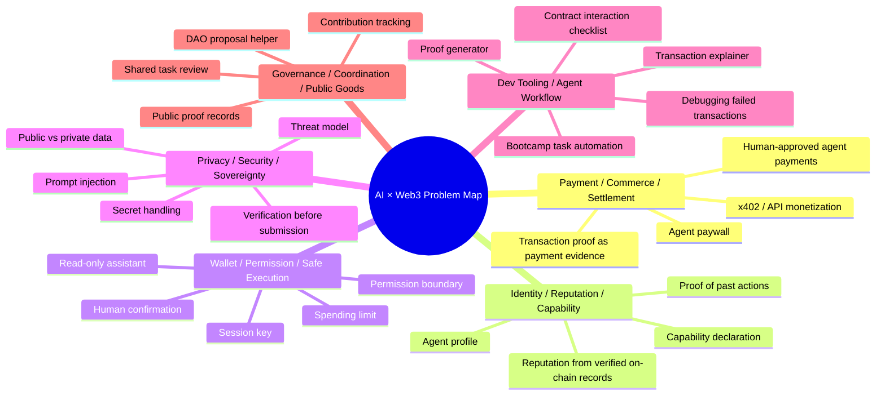

# Week 2｜AI × Web3 问题地图与主方向选择

Status: done

## 任务目标

Week 2 的第一步不是马上继续堆功能，而是先把 AI × Web3 里可能做的方向摊开看一遍。

我这周会围绕一个核心问题思考：

> AI agent 如果要进入 Web3 执行层，怎样才能既有用，又不越权？

我已经在 Week 1 做出了一个只读型工具 **Bootcamp Proof Generator**。它目前只读取公开链上交易数据，不连接钱包，不签名，不发交易。Week 2 我想从这个基础继续往下拆：它可以变成什么方向？哪些方向是真的 AI × Web3 问题，而不只是套一层 AI 或套一层链？

## 问题地图

## 方向 1：Payment / Commerce / Settlement

这个方向关注的是：AI agent 如何参与支付、商业流程和结算。

AI 可以做什么：

- 帮用户解释一笔支付或结算交易。
- 根据订单、API 调用或任务结果生成支付说明。
- 帮用户生成付款前的风险检查清单。
- 在支付完成后整理 proof。

Web3 机制提供什么：

- 链上支付记录。
- 可验证的 tx hash。
- 稳定币或测试网支付流程。
- x402 / paywall 这类机器可读支付机制。

为什么它不是纯 AI 问题：

- 纯 AI 只能生成付款说明，不能提供真实结算记录。
- 真正的支付状态需要链上交易、receipt 或支付协议验证。

为什么它不是纯 Web3 问题：

- 纯链上支付只告诉我交易发生了，不会自动解释交易和业务含义。
- AI 可以把交易转成用户能理解的 proof 和流程说明。

我的兴趣点：

Bootcamp Proof Generator 已经能生成交易 proof。后面可以进一步想：如果一个 agent 提供 API 服务或任务服务，用户付款后能不能自动生成“支付 + 服务结果”的 proof？

## 方向 2：Identity / Reputation / Capability

这个方向关注的是：AI agent 如何声明自己是谁、能做什么、做过什么。

AI 可以做什么：

- 生成 agent profile。
- 说明 agent 的能力、限制和适用场景。
- 总结 agent 过去完成的任务。
- 把链上记录整理成 reputation 证明。

Web3 机制提供什么：

- 地址、合约、交易记录。
- 可验证的公开行为历史。
- 链上身份或声誉数据。

为什么它不是纯 AI 问题：

- AI 自己说“我做过什么”不可靠，可能会编造。
- 需要链上记录或公开 proof 来验证。

为什么它不是纯 Web3 问题：

- 链上记录本身太底层，普通人很难直接理解。
- AI 可以把地址历史、交易行为、任务 proof 转成更容易读的能力说明。

我的兴趣点：

我可以把 Bootcamp Proof Generator 扩展成“agent proof reader”：不仅解释一笔交易，还能解释一个 agent / 地址过去做过哪些可验证动作。

## 方向 3：Wallet / Permission / Safe Execution

这个方向关注的是：AI agent 到底能被允许做什么，不能做什么。

AI 可以做什么：

- 生成交易说明。
- 准备操作 checklist。
- 解释合约调用风险。
- 在权限边界内执行低风险动作。

Web3 机制提供什么：

- EOA、智能账户、多签账户。
- session key。
- spending limit。
- signer / owner 权限。
- 链上交易和合约状态。

为什么它不是纯 AI 问题：

- AI 不能靠“自觉”保证安全。
- 需要钱包、智能账户、多签和权限规则来限制它。

为什么它不是纯 Web3 问题：

- 纯钱包权限只能限制动作，不能解释用户为什么要做这个动作。
- AI 可以帮用户理解风险、生成确认说明和失败恢复步骤。

我的兴趣点：

这是我目前最想深入的方向。Week 1 我已经理解了 EOA、智能账户、多签的差异，也做了一个不连接钱包的只读助手。下一步可以研究：如果未来允许 agent 执行部分动作，权限边界应该怎么设计？

## 方向 4：Privacy / Security / Sovereignty

这个方向关注的是：AI agent 在使用数据和工具时如何不泄露秘密、不被攻击、不越权。

AI 可以做什么：

- 帮用户做 threat model。
- 检查 proof 里是否误放了 secret。
- 提醒用户不要提交私钥、助记词、API key、`.env`。
- 解释 prompt injection 或恶意输入风险。

Web3 机制提供什么：

- 公私钥边界。
- 链上公开数据和链下私密数据的区别。
- 钱包签名确认。
- 合约权限和事件日志。

为什么它不是纯 AI 问题：

- 安全不能只靠模型提醒。
- 需要明确的工具权限、数据边界和人工确认。

为什么它不是纯 Web3 问题：

- Web3 只保证链上记录可验证，不会自动保护用户不把秘密复制到错误地方。
- AI 可以做检查、提醒和解释，但不能代替安全设计。

我的兴趣点：

我在 Week 1 已经踩过 API key / `.env` / repo 安全边界的问题，所以这个方向对我很实际。之后我希望工具能自动检查 proof 中是否包含敏感信息。

## 方向 5：Dev Tooling / Agent Workflow

这个方向关注的是：如何做给 builder 用的小工具，让 AI 帮助理解、调试和记录链上开发过程。

AI 可以做什么：

- 解释交易失败原因。
- 解释合约调用和 logs。
- 生成学习 proof。
- 生成任务 checklist。
- 帮开发者整理 README 和提交材料。

Web3 机制提供什么：

- RPC 读取 transaction / receipt。
- 区块浏览器链接。
- ABI、logs、events。
- 合约地址和交易哈希。

为什么它不是纯 AI 问题：

- AI 如果没有真实链上数据，很容易编造结果。
- 工具必须先读取真实 transaction / receipt。

为什么它不是纯 Web3 问题：

- RPC 和 explorer 返回的数据很底层。
- AI 可以把底层数据翻译成学习者和开发者能理解的语言。

我的兴趣点：

Bootcamp Proof Generator 本质上就是这个方向：它把链上交易数据变成作业 proof。这个方向最贴近我当前能力，也能继续往链上数据分析 + agent 工具演进。

## 候选方向对比

| 候选方向 | 为什么适合我 | AI 作用 | Web3 机制 | 风险 |
| --- | --- | --- | --- | --- |
| Wallet / Permission / Safe Execution | 我刚学完 EOA、智能账户、多签，也关心 agent 权限边界 | 解释风险、生成确认说明、准备 checklist | 钱包、智能账户、多签、session key、限额 | agent 越权、权限配置错误、用户误签 |
| Dev Tooling / Agent Workflow | 我已经做了 Bootcamp Proof Generator，有实际 demo | 解释交易、生成 proof、辅助调试和记录 | tx hash、receipt、RPC、explorer、ABI | AI 编造解释、RPC 失败、复杂合约理解不准 |

## 最终主方向选择

我选择的 Week 2 主线是：

> **Dev Tooling / Agent Workflow：面向链上数据解释和学习证明的受限 AI agent 工具**

更具体一点：

> 继续围绕 Bootcamp Proof Generator，把它从“交易 proof 生成器”深化成一个受限的链上数据解释助手。

## 为什么选择这个方向

1. 它延续了我 Week 1 已经完成的成果，不是重新开坑。
2. 它和我的长期目标“链上数据分析 + AI agent”最接近。
3. 它足够安全：先做只读公开数据，不碰私钥和钱包权限。
4. 它能服务真实学习场景：新手经常需要理解 tx hash、receipt、gas、logs、合约调用。
5. 它也能自然连接到 Week 2 的权限、安全、支付和 identity 主题。

## 它不是纯 AI 问题

如果没有真实链上数据，AI 只能猜交易做了什么，很容易幻觉。

这个方向必须依赖 Web3 数据源：

- transaction
- transaction receipt
- block explorer
- contract address
- logs / events
- gas used
- status

AI 的作用是解释和整理，不是凭空生成事实。

## 它不是纯 Web3 问题

区块浏览器和 RPC 能给出真实数据，但对新手不友好。

这个方向需要 AI 帮忙：

- 把底层字段翻译成大白话。
- 告诉用户这笔交易可能属于什么类型。
- 生成 bootcamp / README / proof-of-work 可以直接使用的文字。
- 提醒用户检查安全边界。

## Week 2 下一步

我准备继续拆这几个问题：

- Bootcamp Proof Generator 应该如何处理复杂合约调用？
- 如何避免 AI 编造交易解释？
- 如何标出“已知数据”和“推测解释”的边界？
- 如果未来加钱包功能，哪些动作必须人工确认？
- 能不能把 proof generator 变成更通用的链上数据学习助手？

## 可提交证明

- [x] 覆盖了至少 5 个 AI × Web3 方向。
- [x] 每个方向都说明了 AI 作用和 Web3 机制。
- [x] 选择了 2 个候选方向。
- [x] 说明了它们为什么不是纯 AI 问题，也不是纯 Web3 问题。
- [x] 最后选择了 1 个 Week 2 主方向。
- [x] 没有包含私钥、助记词、API key、token、`.env` 或真实资金账户敏感信息。
